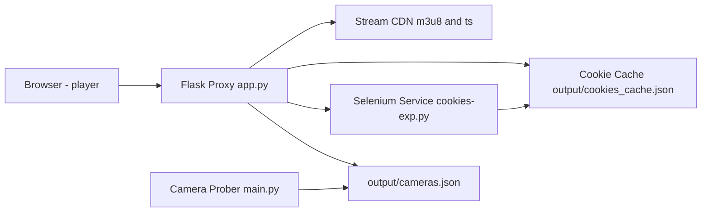

# HLS Cookies Proxy for CCTV Portal

Project ini adalah stack Python untuk mengakses stream CCTV berbasis HLS (`.m3u8` + segmen `.ts`) yang dilindungi cookie sesi lintas subdomain.

Repositori ini punya 3 komponen utama:

1. **Cookie Scraper Service** (`cookies-exp.py`)
2. **Camera Discovery/Prober** (`main.py`)
3. **HLS Proxy + Web Player** (`app.py` + `templates/player.html`)

Tujuan utamanya adalah menjaga agar browser klien hanya bicara ke server lokal, sementara proxy yang menangani cookie dan request ke server stream eksternal.

---

## Kenapa Project Ini Diperlukan?

Server stream CCTV tidak cukup hanya diakses dengan URL `index.m3u8`. Ia butuh cookie sesi seperti `cctv_access`, `stream_token`, `hlsSession`, dan `cookieCheck`.

- Cookie biasanya terbentuk setelah mengunjungi portal utama.
- Cookie tertentu terikat domain/path spesifik.
- Jika cookie hilang/expired, stream biasanya gagal (`401`/`403`).

Project ini menangani masalah itu dengan:

- scraping dan refresh cookie otomatis via Selenium,
- menyimpan cookie ke cache lokal,
- mem-proxy playlist dan segmen agar playback tetap jalan dari origin lokal.

---

## Arsitektur Singkat



Alur runtime utama:

1. `cookies-exp.py` menavigasi portal/stream, lalu mengambil cookie (termasuk lintas domain via CDP).
2. Cookie dinormalisasi dan disimpan ke `output/cookies_cache.json`.
3. `app.py` membangun `requests.Session` dari cookie cache.
4. Endpoint `/proxy/playlist` mengambil `m3u8`, rewrite URL segmen/sub-playlist ke endpoint lokal.
5. Endpoint `/proxy/segment` mengambil segmen `.ts`/`.m4s` memakai session cookie yang sama.
6. `player.html` memutar stream via HLS.js dari endpoint proxy lokal.

---

## Struktur Folder

```text
.
├── app.py
├── main.py
├── cookies-exp.py
├── config.py
├── requirements.txt
├── scraper/
│   ├── __init__.py
│   ├── extractor.py
│   ├── models.py
│   ├── utils.py
│   └── exceptions.py
├── templates/
│   └── player.html
├── output/
│   ├── cameras.json
│   └── cookies_cache.json
└── cache_segments/
```

---

## Prasyarat

- Python 3.10+
- Google Chrome/Chromium
- ChromeDriver kompatibel
- OS Windows/Linux (script sudah lintas platform, tetapi path ChromeDriver di `cookies-exp.py` lebih condong Linux pada default)

> Catatan: `build_chrome_driver()` mencoba path `/usr/bin/chromedriver` lalu fallback ke PATH environment. Di Windows, pastikan ChromeDriver tersedia di PATH jika tidak pakai Linux path.

---

## Instalasi

```bash
pip install -r requirements.txt
```

---

## Cara Menjalankan

### 1) Jalankan cookie service

```bash
python cookies-exp.py --port 5001
```

### 2) Ambil daftar kamera (opsional tapi direkomendasikan)

Mode API backend:

```bash
python main.py
```

Mode probe sequential:

```bash
python main.py --probe 50 --workers 10
```

### 3) Jalankan proxy + player

```bash
python app.py
```

### 4) Buka dashboard player

- `http://localhost:5000/player`

---

## Endpoint Penting

### Dari `app.py`

- `GET /` : health/info endpoint.
- `POST /api/refresh-cookies` : refresh cookie dari Selenium service.
- `GET /api/cameras` : baca `output/cameras.json`.
- `POST /api/scrape` : fetch ulang daftar kamera dari API backend.
- `GET /api/debug-session` : inspeksi cookie aktif di session proxy.
- `POST /api/inject-cookies` : inject cookie manual ke session aktif.
- `GET /proxy/playlist?url=...` : proxy + rewrite file `.m3u8`.
- `GET /proxy/segment?url=...` : proxy segmen video/audio.

### Dari `cookies-exp.py`

- `GET /` : health check service.
- `POST /scrape` : scraping cookie berbasis URL target.
- `POST /import` : import cookie manual lewat JSON body.

---

## File Konfigurasi

Atur nilai default di `config.py`:

- `PORTAL_URL`
- `STREAM_REFERER`
- `CAMERAS_OUTPUT_FILE`
- `COOKIES_CACHE_FILE`
- `COOKIES_MANUAL_FILE`
- `COOKIE_SERVICE_URL`
- `PROXY_HOST`, `PROXY_PORT`
- `TIMEOUT`

---

## Troubleshooting

1. **`401/403` saat akses playlist/segmen**
   - Jalankan `POST /api/refresh-cookies`.
   - Pastikan `cookies-exp.py` aktif di port `5001`.
   - Cek `/api/debug-session` untuk memastikan cookie kunci tersedia.

2. **Daftar kamera kosong**
   - Jalankan `python main.py` atau `POST /api/scrape`.
   - Cek koneksi ke API kamera target.

3. **Selenium gagal start**
   - Cek instalasi Chrome/Chromium + ChromeDriver.
   - Pastikan ChromeDriver bisa dipanggil dari PATH.

4. **Video tidak tampil tapi request jalan**
   - Cek console browser dan response `/proxy/playlist`.
   - Pastikan URL stream valid dan kamera memang aktif.

---

## Catatan Keamanan dan Push ke Git

Project ini menyimpan data sensitif runtime (khususnya cookie sesi) secara lokal. Jangan commit file berikut:

- `cookies.json`
- `output/cookies_cache.json`
- isi folder `cache_segments/`
- file env lokal (`.env*`, kecuali `.env.example`)

`.gitignore` sudah diperbarui agar aman untuk kebutuhan push harian.

---

## Saran Pengembangan Lanjut

- Pindahkan API key hardcoded ke environment variable.
- Tambahkan unit test untuk fungsi rewrite playlist dan cookie/session fallback.
- Tambahkan endpoint health khusus untuk cek konektivitas ke stream CDN.
- Tambahkan strategi invalidasi cache segmen (TTL/max size) agar disk tidak terus membesar.
